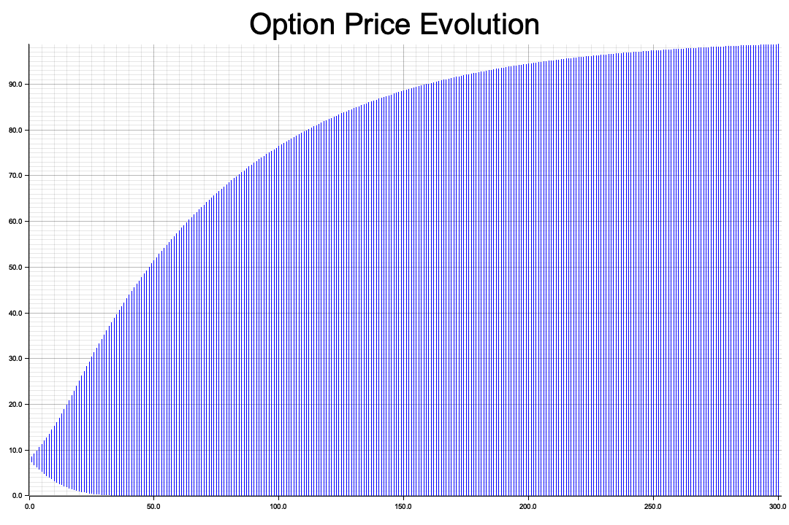
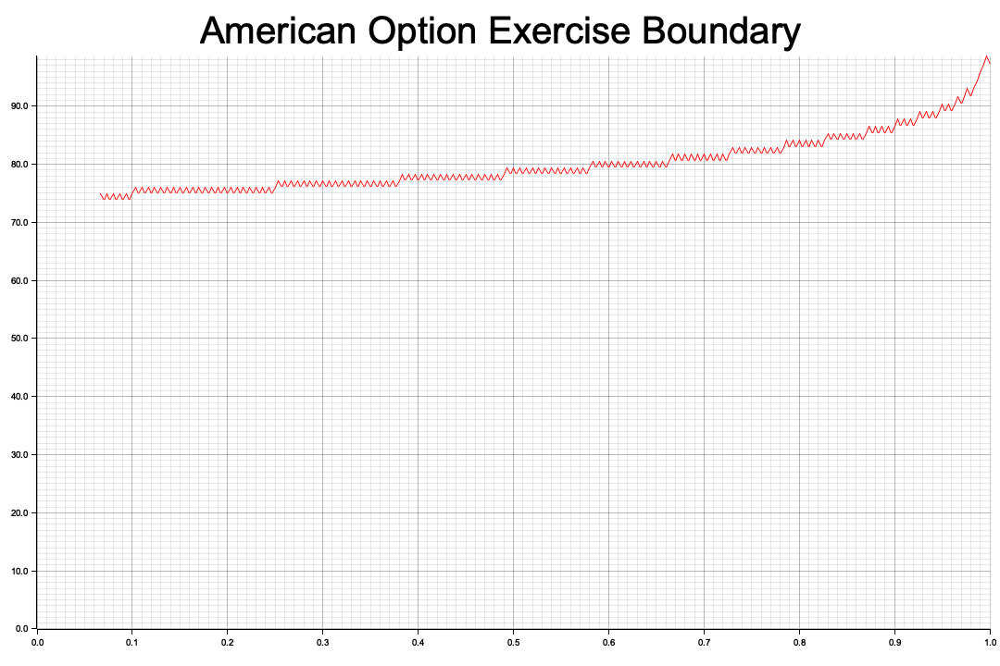

# Binomial Options Pricing Model as a Finite Markov Decision Process (MDP)

We aim to model the pricing and optimal exercise of American Options using the Binomial Options Pricing Model, as described by [Cox, Ross, Rubinstein(1979)](https://www.sciencedirect.com/science/article/pii/0304405X79900151)

. The core idea behind this approach is to model the underlying asset price dynamics as a discrete-time stochastic process with two possible outcomes at each step, therefore forming a binomial tree. The exercise problem is then cast as a finite-horizon MDP, where at each node (state), the agent (option holder) makes a decision: either to exercise the option or continue to the next period.

### 1.1 Underlying Assumptions
- The market is complete and frictionless: there are no transaction costs, and assets can be traded in any real-valued quantities.
- The underlying asset price evolves according to a lognormal stochastic process in continuous time, but is approximated using a discrete-time, finite-horizon, finite-state process.
- The risk-neutral measure is used to price the option, where the expected growth rate of the underlying asset is the risk-free rate $r$.

## 2. Continuous-Time Lognormal Stochastic Process

The price of the underlying asset $S_t$ follows a stochastic process described by the Geometric Brownian Motion:

$$
dS_t = r S_t \, dt + \sigma S_t \, dz_t
$$

where:
- $r$ is the risk-free interest rate,
- $\sigma$ is the volatility of the underlying asset,
- $z_t$ is a Wiener process (Brownian motion) under the risk-neutral measure.

## 3. Binomial Tree Approximation

We discretize the continuous-time process using a binomial tree. The discrete-time process has $n$ time steps (denoted $i = 0, 1, \dots, n$) over the time horizon $[0, T]$. The time step interval is $\Delta t = \frac{T}{n}$.

At each time step, the underlying asset price can either increase by a factor of $u$ or decrease by a factor of $d$. The parameters $u$, $d$, and $q$ (the probability of an upward movement) are chosen such that the binomial tree approximates the risk-neutral process. We use the Cox-Ross-Rubinstein (CRR) method to calibrate these parameters:

### 3.1 Calibration of $u$ and $d$

Ignoring the drift term (i.e., assuming the asset price follows a martingale), we choose $u$ and $d = \frac{1}{u}$ such that the variance of the price movements matches that of the lognormal process. This gives:

$$
u = e^{\sigma \sqrt{\Delta t}}, \quad d = \frac{1}{u}
$$

where $\sigma$ is the volatility of the underlying asset.

### 3.2 Calibration of $q$

To account for the drift term under the risk-neutral measure, we adjust $q$ so that the expected price change matches the drift in the lognormal process. Specifically, we require that:

$$
q u + (1 - q) d = e^{r \Delta t}
$$

Solving for $q$, we obtain:

$$
q = \frac{e^{r \Delta t} - d}{u - d} = \frac{e^{r \Delta t} - e^{-\sigma \sqrt{\Delta t}}}{e^{\sigma \sqrt{\Delta t}} - e^{-\sigma \sqrt{\Delta t}}}
$$

## 4. States and Transitions

The states of the MDP represent the prices of the underlying asset at each time step. The price at time step $i$ in state $j$ is denoted by $S_{i,j}$ and is given by:

$$
S_{i,j} = S_0 \cdot u^j \cdot d^{i - j}, \quad 0 \leq j \leq i
$$

where $S_0$ is the initial price of the underlying asset.

At each time step $i$, the number of possible price outcomes is $i + 1$. This forms a recombining binomial tree, where an upward movement followed by a downward movement leads to the same price as a downward movement followed by an upward movement.

The state transitions are probabilistic, with the transition probabilities determined by $q$ for an upward movement and $1 - q$ for a downward movement.

## 5. American Option Pricing as an MDP

We now formulate the problem of pricing and optimally exercising an American option as an MDP.

### 5.1 Actions

At each time step $i$ and state $j$, the option holder has two possible actions:
1. Exercise the option immediately, in which case the option is exercised and the payoff is realized.
2. Continue holding the option, in which case the process moves to the next time step according to the binomial tree transitions.

### 5.2 Payoff Function

The payoff function $P(t, S)$ depends on the type of option:
- For an American Call Option with strike price $K$, the payoff is:

$$
P(t, S) = \max(S - K, 0)
$$

- For an American Put Option with strike price $K$, the payoff is:

$$
P(t, S) = \max(K - S, 0)
$$

### 5.3 Value Function and Bellman Equation

The value function $V_{i,j}$ at time step $i$ and state $j$ represents the maximum expected payoff from that point onwards. The Bellman equation governs the value function, considering the two possible actions:

$$
V_{i,j} = \max \left( P(i \Delta t, S_{i,j}), \, e^{-r \Delta t} \left( q V_{i+1,j+1} + (1 - q) V_{i+1,j} \right) \right)
$$

This equation captures the risk-neutral discounted expectation of the option payoff at the next time step, weighed against the immediate exercise value.

### 5.4 Backward Induction

To compute the value function $V_{i,j}$ and the optimal policy, we use backward induction starting from the terminal time $T$:
- At time $T$, the value is simply the payoff:

$$
V_{n,j} = P(T, S_{n,j})
$$

- For earlier time steps, we apply the Bellman equation to compute the value recursively.

### 5.5 Optimal Policy

The optimal policy $\pi_{i,j}$ at each time step $i$ and state $j$ is binary:
- $\pi_{i,j} = \text{True}$ if it is optimal to exercise the option.
- $\pi_{i,j} = \text{False}$ if it is optimal to continue holding the option.

The policy is determined by comparing the immediate payoff with the discounted continuation value.

## 6. Pricing American Options

For American options, it is optimal to exercise the option early in some cases (for put options, for example), and this leads to a higher price than for European options. Using the backward induction and Bellman equation described above, we can compute the price of the American option as $V_{0,0}$ — the value function at the initial state and time.

For a European Option, the price can be computed using the Black-Scholes formula since there is no possibility of early exercise.

## 7. Example: Pricing an American Put Option

Consider an American Put Option with the following parameters:
- Spot price: $S_0 = 100$
- Strike price: $K = 100$
- Expiry: $T = 1$ year
- Risk-free rate: $r = 5\%$
- Volatility: $\sigma = 25\%$
- Number of steps: $n = 300$

By applying the backward induction method described above, we compute the option prices:
- European Put Option Price: $7.459$
- American Put Option Price: $7.971$

The difference arises because the American option can be exercised early, and the optimal exercise boundary can be computed to determine at which asset price levels it is advantageous to exercise early.
